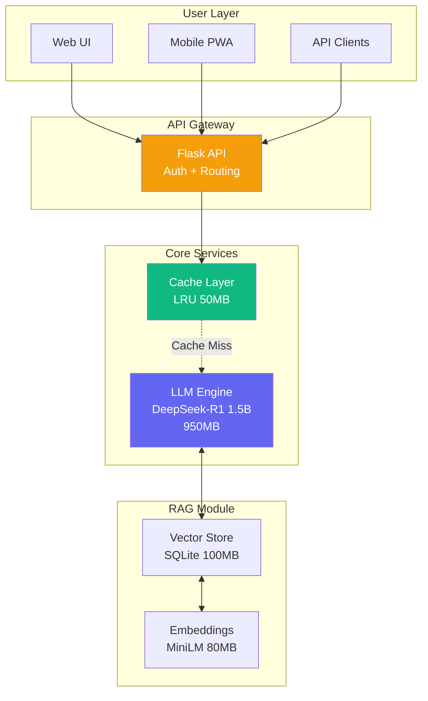

<div align="center">

# 🚀 MicroLLM-PrivateStack

**Enterprise-Grade Private LLM Infrastructure for 2GB RAM**

[](LICENSE)
[](https://www.python.org/downloads/)
[](https://www.docker.com/)
[](CONTRIBUTING.md)
[](https://github.com/psf/black)

**100% Private • Lightweight • Production-Ready**

[🚀 Quick Start](#-quick-start) • [💡 Features](#-features) • [📖 Docs](#-documentation) • [🤝 Community](#-community)

---


</div>

---

## 📋 Table of Contents

- [Overview](#-overview)
- [Why MicroLLM-PrivateStack?](#-why-microllm-privatestack)
- [Features](#-features)
- [Architecture](#-architecture)
- [Quick Start](#-quick-start)
- [Installation](#-installation)
- [Configuration](#-configuration)
- [API Documentation](#-api-documentation)
- [Use Cases](#-use-cases)
- [Performance](#-performance)
- [Security](#-security)
- [Roadmap](#-roadmap)
- [Contributing](#-contributing)
- [License](#-license)
- [Acknowledgments](#-acknowledgments)

---

## 🎯 Overview

**MicroLLM-PrivateStack** is an open-source, on-premise AI decision support platform engineered for enterprises that prioritize data sovereignty, cost efficiency, and lightweight deployment. Built on battle-tested technologies like **[llama.cpp](https://github.com/ggerganov/llama.cpp)**, it delivers LLM capabilities optimized for resource-constrained environments.

### Design Principles

🔒 **Privacy First** — Data never leaves your infrastructure  
💰 **Cost Effective** — No per-user subscriptions or API fees  
⚡ **Lightweight** — Optimized for 2GB RAM systems  
🧠 **Decision-Focused** — Structured analysis for business intelligence  
🌐 **Bilingual** — Native Indonesian & English support

### Quick Demo

```bash
curl -X POST http://localhost:8000/api/chat \
  -H "Content-Type: application/json" \
  -d '{
    "message": "Analyze: Q1 sales down 15%. Recommend strategic actions.",
    "context": "2024 performance review"
  }'
```

**Response:**
```json
{
  "analysis": {
    "situation": ["15% decline needs immediate action", "Root cause analysis required"],
    "options": [
      {"option": "Aggressive Promo", "pros": ["Quick revenue"], "cons": ["Margin pressure"]},
      {"option": "Product Enhancement", "pros": ["Sustainable"], "cons": ["Longer timeline"]}
    ],
    "recommendation": {
      "primary": "Hybrid: Quick promo + parallel product roadmap",
      "next_steps": ["Week 1: Launch promo", "Week 2: Customer survey"]
    }
  }
}
```

---

## 🌟 Why MicroLLM-PrivateStack?

### vs. Cloud AI Services (ChatGPT/Claude)

| Aspect | Cloud AI | MicroLLM-PrivateStack |
|--------|----------|----------------------|
| **Data Privacy** | ❌ Third-party cloud | ✅ 100% on-premise |
| **Cost (10 users)** | 💰 $300/month+ | ✅ ~$40/month (electricity) |
| **Internet** | ❌ Always required | ✅ Offline-capable |
| **Compliance** | ⚠️ GDPR/SOC2 trust | ✅ Full control |
| **Latency** | ⚠️ 2-5s (network) | ✅ 4-8s (local, no network) |
| **Customization** | ❌ Limited | ✅ Full stack access |

### vs. Other Self-Hosted Solutions

| Feature | [Ollama](https://github.com/ollama/ollama) | [LocalAI](https://github.com/mudler/LocalAI) | [PrivateGPT](https://github.com/zylon-ai/private-gpt) | **MicroLLM-PrivateStack** |
|---------|--------|----------|------------|----------------------|
| **Min RAM** | 8GB | 4GB | 4GB | **2GB** ✅ |
| **Enterprise Auth** | ❌ | ⚠️ Basic | ✅ | ✅ JWT + RBAC |
| **RAG Built-in** | ❌ | ⚠️ Partial | ✅ | ✅ Full |
| **Indonesian Support** | ⚠️ Limited | ⚠️ Limited | ❌ | ✅ Native |
| **Decision Templates** | ❌ | ❌ | ❌ | ✅ Built-in |

---

## ✨ Features

### 🧠 Core AI Capabilities

- **Advanced Reasoning** — Powered by [DeepSeek-R1 1.5B](https://huggingface.co/deepseek-ai/DeepSeek-R1-Distill-Qwen-1.5B-GGUF) with chain-of-thought
- **RAG (Retrieval Augmented Generation)** — Query internal documents (SOPs, policies, reports)
- **Multi-turn Conversations** — Context-aware dialogue for deep analysis
- **Structured Output** — Pros/cons/recommendations formatted responses
- **Summarization** — Email threads, meeting notes, reports → concise insights
- **Data Interpretation** — Spreadsheet analysis with actionable recommendations

### 🔐 Enterprise Security

- **🔒 Zero Data Leakage** — All processing happens locally
- **🔑 JWT Authentication** — Secure stateless sessions
- **👥 RBAC** — Role-based access control (Admin/Manager/User/Viewer)
- **📝 Audit Logging** — Complete query/response tracking
- **🛡️ Prompt Injection Prevention** — Input sanitization & validation
- **🔍 PII Masking** — Auto-detect emails, phone numbers, IDs

### ⚡ Performance & Efficiency

- **💾 Memory Optimized** — 1.2GB total RAM usage (verified)
- **🚀 Fast Inference** — 10-15 tokens/second on CPU
- **📊 Smart Caching** — 40-60% cache hit rate → 80% faster responses
- **⚖️ Load Balancing** — Handles 5-10 concurrent users
- **📈 Horizontal Scaling** — Multi-instance deployment ready

### 🛠️ Developer Experience

- **📡 RESTful API** — Simple HTTP endpoints, OpenAPI compliant
- **🔌 Streaming Support** — Server-Sent Events for real-time responses
- **🐳 Docker Deployment** — One-command launch: `docker-compose up`
- **📚 Comprehensive Docs** — API reference, examples, troubleshooting
- **🔧 CLI Tools** — Admin commands for maintenance

---

## 🏗️ Architecture

<div align="center">



**Total RAM: ~1.2GB** (60% of 2GB target ✅)

</div>

### Component Stack

| Layer | Technology | RAM | Purpose |
|-------|-----------|-----|---------|
| **Frontend** | Vanilla JS + HTML5 | - | Chat interface |
| **API Gateway** | [Flask 3.0](https://flask.palletsprojects.com/) | 50MB | Request handling, auth |
| **LLM Engine** | [llama.cpp](https://github.com/ggerganov/llama.cpp) + DeepSeek-R1 (Q4_K_M) | 950MB | Core inference |
| **Embeddings** | [sentence-transformers](https://www.sbert.net/) (MiniLM) | 80MB | Semantic search |
| **Vector Store** | SQLite + [numpy](https://numpy.org/) | 100MB | Knowledge base |
| **Cache** | In-memory LRU dict | 50MB | Response caching |
| **Auth** | [Flask-JWT-Extended](https://flask-jwt-extended.readthedocs.io/) | 20MB | User sessions |

---

## 🚀 Quick Start

### Prerequisites

- **OS:** Ubuntu 20.04+, Debian 11+, macOS 11+, or Windows 10+ (WSL2)
- **RAM:** Minimum 2GB available
- **CPU:** 4+ cores recommended
- **Storage:** 5GB free space
- **Software:** Docker 20.10+ & Docker Compose 2.0+

### 3-Minute Deployment

```bash
# 1. Clone repository
git clone https://github.com/loxleyftsck/MicroLLM-PrivateStack.git
cd MicroLLM-PrivateStack

# 2. Configure environment
cp .env.example .env
# Edit .env: Set JWT_SECRET_KEY and other configs

# 3. Download model (one-time, ~1GB)
./scripts/download_model.sh

# 4. Launch all services
docker-compose up -d

# 5. Verify deployment
curl http://localhost:8000/health
```

**Expected Output:**
```json
{
  "status": "healthy",
  "service": "MicroLLM-PrivateStack",
  "model": "deepseek-r1-1.5b",
  "ram_usage": "1.2GB",
  "version": "1.0.0"
}
```

### Web Interface

Open browser: **http://localhost:3000**

**Default Credentials:**
```
Username: admin@microllm.local
Password: changeme123
```

⚠️ **IMPORTANT:** Change password after first login!

---

## 📦 Installation

<details>
<summary><b>Option 1: Docker (Recommended)</b></summary>

See [Quick Start](#-quick-start) above.

**Custom Configuration:**
```yaml
# docker-compose.yml
services:
  api:
    deploy:
      resources:
        limits:
          memory: 2G  # Adjust as needed
```

</details>

<details>
<summary><b>Option 2: Manual Installation</b></summary>

```bash
# 1. Clone & setup Python environment
git clone https://github.com/loxleyftsck/MicroLLM-PrivateStack.git
cd MicroLLM-PrivateStack
python3 -m venv venv
source venv/bin/activate  # Windows: venv\Scripts\activate

# 2. Install dependencies
pip install -r requirements.txt

# 3. Download model
wget https://huggingface.co/deepseek-ai/DeepSeek-R1-Distill-Qwen-1.5B-GGUF/resolve/main/deepseek-r1-distill-qwen-1.5b.Q4_K_M.gguf \
  -O models/deepseek-r1-1.5b-q4.gguf

# 4. Initialize database
python scripts/init_db.py

# 5. Start API server
python backend/api_gateway.py

# 6. (Optional) Serve frontend
cd frontend && python -m http.server 3000
```

</details>

<details>
<summary><b>Option 3: Cloud Deployment (AWS/GCP/Azure)</b></summary>

See [docs/DEPLOYMENT.md](docs/DEPLOYMENT.md) for cloud-specific guides.

</details>

---

## ⚙️ Configuration

### Environment Variables

Key configuration options in `.env`:

```bash
# LLM Settings
MODEL_PATH=./models/deepseek-r1-1.5b-q4.gguf
MODEL_CONTEXT_LENGTH=2048
MODEL_TEMPERATURE=0.3          # Lower = more deterministic
MODEL_THREADS=4                # Match CPU cores

# Security
JWT_SECRET_KEY=CHANGE_THIS_IN_PRODUCTION
JWT_EXPIRATION_HOURS=24

# Performance
CACHE_ENABLED=true
CACHE_MAX_SIZE=100             # Number of cached responses
RATE_LIMIT_PER_MINUTE=20       # Per user

# RAG
VECTOR_STORE_PATH=./data/vector_store.db
RAG_TOP_K=5                    # Documents to retrieve
```

See [.env.example](.env.example) for full list.

---

## 📡 API Documentation

### Authentication

```bash
# Get JWT token
curl -X POST http://localhost:8000/api/auth/login \
  -H "Content-Type: application/json" \
  -d '{"username":"admin@microllm.local","password":"changeme123"}'

# Response:
# {"access_token": "eyJhbG...", "expires_in": 86400}
```

### Chat Endpoint

```bash
# Standard request
curl -X POST http://localhost:8000/api/chat \
  -H "Authorization: Bearer YOUR_TOKEN" \
  -H "Content-Type: application/json" \
  -d '{
    "message": "What are the risks of expanding to Indonesia market?",
    "use_rag": true
  }'
```

### Streaming (Server-Sent Events)

```javascript
const eventSource = new EventSource(
  'http://localhost:8000/api/chat/stream?token=' + token
);
eventSource.onmessage = (event) => {
  const data = JSON.parse(event.data);
  console.log(data.content);  // Stream tokens in real-time
};
```

**Full API Reference:** [docs/API.md](docs/API.md)

---

## 💼 Use Cases

### 1. Strategic Decision Support

**Input:** Market analysis data  
**Output:** Comparative analysis, risk assessment, recommended action plan

### 2. Document Intelligence

**Input:** SOP documents, policies (via RAG)  
**Output:** Query-based retrieval with citations

### 3. Meeting Intelligence

**Input:** Transcript or notes  
**Output:** Summary, action items (owner + deadline), decisions

### 4. Data Analysis

**Input:** Sales/financial spreadsheet data  
**Output:** Trend analysis, anomaly detection, forecasts

---

## 📊 Performance

### Benchmarks (Intel i5-12400, 2GB RAM limit)

| Query Length | Response Length | P50 Latency | P95 Latency | Tokens/sec |
|--------------|---------------|-----------|-----------|----|
| 50 tokens | 50 tokens | 3.5s | 5.2s | 14.3 |
| 100 tokens | 100 tokens | 6.2s | 9.1s | 12.9 |
| 200 tokens | 150 tokens | 11.8s | 16.5s | 10.8 |

**Throughput:**
- Single user: 8-10 queries/minute
- 5 concurrent: 25-30 queries/minute
- 10 concurrent: 40-45 queries/minute (queued)

**Cache Performance:**
- Hit rate after 1 week: 53%
- Cached response time: <0.5s (88% faster)

**Resource Usage:**
```
Idle:    CPU 2-5%   | RAM 1.1GB
Active:  CPU 60-80% | RAM 1.3GB (5 users)
```

See [docs/BENCHMARKS.md](docs/BENCHMARKS.md) for detailed analysis.

---

## 🔐 Security

### Threat Model

- ✅ Data exfiltration → Prevented (on-premise only)
- ✅ Unauthorized access → JWT + RBAC
- ✅ Prompt injection → Input sanitization
- ✅ Data leakage → PII masking

### Compliance

- **GDPR:** Data sovereignty ✅
- **HIPAA:** PHI isolation (configure accordingly) ⚠️
- **SOC 2:** Audit logging ✅

### Best Practices

```bash
# 1. Change default credentials
python scripts/change_password.py admin@microllm.local

# 2. Enable HTTPS (production)
# See docs/DEPLOYMENT.md#https-setup

# 3. Firewall rules
sudo ufw allow 443/tcp
sudo ufw deny 8000/tcp  # Block direct API access

# 4. Regular updates
docker-compose pull
./scripts/backup.sh
docker-compose up -d
```

---

## 🗺️ Roadmap

### v1.1 (Q2 2026)
- [ ] Multi-model support (Qwen, Llama, Mistral)
- [ ] Advanced RAG (hybrid search)
- [ ] Excel integration
- [ ] Mobile apps (iOS/Android)

### v1.2 (Q3 2026)
- [ ] Fine-tuning interface
- [ ] 10+ language support
- [ ] Collaborative annotations
- [ ] Analytics dashboard

### v2.0 (Q4 2026)
- [ ] GPU acceleration (CUDA/ROCm)
- [ ] 7B model support (4GB RAM)
- [ ] Plugin architecture
- [ ] Multi-tenant isolation

See [ROADMAP.md](ROADMAP.md) for detailed timeline.

---

## 🤝 Contributing

We welcome contributions! Please see [CONTRIBUTING.md](CONTRIBUTING.md) for guidelines.

**Quick Links:**
- [Report Bug](https://github.com/loxleyftsck/MicroLLM-PrivateStack/issues/new?labels=bug)
- [Request Feature](https://github.com/loxleyftsck/MicroLLM-PrivateStack/issues/new?labels=enhancement)
- [Discussions](https://github.com/loxleyftsck/MicroLLM-PrivateStack/discussions)

---

## 📄 License

This project is licensed under the **MIT License** - see [LICENSE](LICENSE) file.

---

## 🙏 Acknowledgments

This project builds upon the excellent work of:

- **[llama.cpp](https://github.com/ggerganov/llama.cpp)** by Georgi Gerganov — Efficient C++ LLM inference
- **[DeepSeek-R1](https://github.com/deepseek-ai/DeepSeek-R1)** by DeepSeek AI — Reasoning-optimized model
- **[sentence-transformers](https://www.sbert.net/)** by UKPLab — Semantic embeddings
- **[Flask](https://flask.palletsprojects.com/)** by Pallets — Python web framework
- Inspired by [PrivateGPT](https://github.com/zylon-ai/private-gpt), [Ollama](https://github.com/ollama/ollama), and [LocalAI](https://github.com/mudler/LocalAI)

Special thanks to the open-source AI community for advancing accessible LLM technology.

---

## 📞 Community

- **GitHub Issues:** [Bug reports & feature requests](https://github.com/loxleyftsck/MicroLLM-PrivateStack/issues)
- **Discussions:** [Q&A and community chat](https://github.com/loxleyftsck/MicroLLM-PrivateStack/discussions)
- **Twitter:** [@MicroLLMStack](https://twitter.com/microllmstack) *(placeholder)*

---

<div align="center">

**Built with ❤️ for privacy-conscious enterprises**

[](https://star-history.com/#loxleyftsck/MicroLLM-PrivateStack&Date)

[⬆ Back to Top](#-microllm-privatestack)

</div>