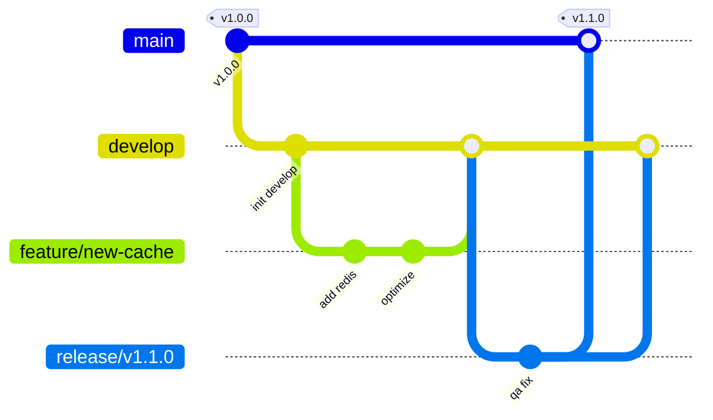

# Branching Model — MicroLLM-PrivateStack

This project follows the **Git Flow** branching model to ensure stable releases and a clean development history.

## 🌿 Branch Structure

### 🏛️ Core Branches
- **`main`**: Production-ready code only. Every merge to `main` must be tagged with a version.
- **`develop`**: The main integration branch for the next release.

### 🛠️ Supporting Branches
- **`feature/*`**: For new features or significant changes. Branch off `develop` and merge back into `develop`.
- **`release/*`**: Preparation for a new production release. Branch off `develop`. Allows for final bug fixes and documentation. Merged into both `main` and `develop`.
- **`hotfix/*`**: Immediate fixes for production issues. Branch off `main` and merge into both `main` and `develop`.

---

## 🏷️ Tagging Conventions

We use [Semantic Versioning (SemVer)](https://semver.org/): `vMAJOR.MINOR.PATCH`

- **MAJOR**: Breaking API or architecture changes.
- **MINOR**: New features, non-breaking.
- **PATCH**: Bug fixes, security patches.

*Example: `v1.2.3`*

---

## 🚀 Workflow Lifecycle

1. **Start Feature**: `git checkout -b feature/name develop`
2. **Finish Feature**: Open PR to `develop`. After merge, branch is deleted.
3. **Start Release**: `git checkout -b release/vX.Y.Z develop`
4. **Finish Release**: Merge to `main`, tag `vX.Y.Z`, then merge to `develop`.
5. **Hotfix**: `git checkout -b hotfix/desc main`. Merge to `main` (tag) and `develop`.
