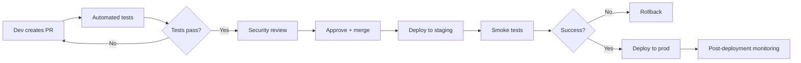

# Compliance Guide - MicroLLM-PrivateStack

**Version:** 1.0.1  
**Applicable Frameworks:** GDPR, SOC 2, ISO 27001  
**Last Updated:** 2026-01-13

---

## Overview

This document maps MicroLLM-PrivateStack controls to major compliance frameworks. It serves as evidence for audits and helps organizations understand regulatory alignment.

**Target Industries:**
- Financial Services (SOC 2, PCI-DSS)
- Healthcare (HIPAA - partial)
- Government (FedRAMP - roadmap)
- EU Operations (GDPR mandatory)

---

## GDPR Compliance

### Article-by-Article Mapping

#### Art. 5 - Principles of Data Processing

| Principle | Requirement | Implementation | Status |
|-----------|-------------|----------------|--------|
| **Lawfulness** | Legal basis for processing | ✅ User consent at registration | ✅ |
| **Purpose Limitation** | Specified, explicit purposes | ✅ Privacy policy defines use cases | ✅ |
| **Data Minimization** | Only necessary data collected | ✅ No tracking, minimal metadata | ✅ |
| **Accuracy** | Kept up-to-date | ⚠️ User self-service update | ⚠️ |
| **Storage Limitation** | Retention limits defined | ✅ 90-day default, user-configurable | ✅ |
| **Integrity/Confidentiality** | Security measures | ✅ Encryption, access control | ✅ |

#### Art. 12-22 - Data Subject Rights

| Right | GDPR Article | Implementation | Evidence |
|-------|--------------|----------------|----------|
| **Right to Access** | Art. 15 | API endpoint `/api/user/data-export` | User dashboard |
| **Right to Rectification** | Art. 16 | Self-service profile editor | Update logs |
| **Right to Erasure** | Art. 17 | `/api/user/delete` + cascade | Deletion audit trail |
| **Right to Data Portability** | Art. 20 | JSON export of all user data | Export feature |
| **Right to Object** | Art. 21 | Opt-out from analytics | Config setting |

**Example Implementation:**
```python
@app.post("/api/gdpr/data-export")
@require_auth
async def export_user_data(user_id: str):
    """Art. 15 - Right to Access"""
    data = {
        "profile": get_user_profile(user_id),
        "chat_history": get_user_chats(user_id),
        "uploaded_docs": get_user_documents(user_id),
        "audit_trail": get_user_activity(user_id)
    }
    return JSONResponse(data, headers={
        "Content-Disposition": f"attachment; filename=data_{user_id}.json"
    })

@app.delete("/api/gdpr/delete-account")
@require_auth
async def delete_account(user_id: str, confirmation: str):
    """Art. 17 - Right to Erasure"""
    if confirmation != "DELETE_MY_DATA":
        raise BadRequest("Confirmation required")
    
    # Cascade delete
    delete_user_chats(user_id)
    delete_user_documents(user_id)
    anonymize_audit_logs(user_id)  # Retain for compliance
    delete_user_account(user_id)
    
    audit_log("gdpr_deletion", user_id=user_id)
    return {"status": "deleted", "effective_date": now()}
```

#### Art. 25 - Privacy by Design

**Principles Applied:**
```yaml
privacy_by_design:
  proactive: "Security measures before deployment"
  default_settings: "Most restrictive privacy settings by default"
  embedded: "Privacy integral to system design"
  functionality: "No trade-off between privacy & functionality"
  lifecycle: "Data protection from ingestion to deletion"
  visibility: "Transparent operations (audit logs)"
  user_centric: "User control over their data"
```

**Evidence:**
- ✅ On-premise deployment (data never leaves infrastructure)
- ✅ Minimal data collection (no telemetry/tracking)
- ✅ Encryption by default (AES-256 at rest, TLS in transit)
- ✅ User-controlled retention periods
- ✅ Open-source (transparency)

#### Art. 30 - Records of Processing Activities

**Processing Activities Register:**
```yaml
activities:
  - name: "Chat Query Processing"
    purpose: "Provide AI decision support"
    data_categories: ["user queries", "AI responses"]
    recipients: "Internal only (local processing)"
    retention: "90 days (user-configurable)"
    security: "AES-256 encryption, access logs"
  
  - name: "Document RAG Indexing"
    purpose: "Enable semantic search"
    data_categories: ["uploaded documents", "embeddings"]
    recipients: "Internal only"
    retention: "Until user deletion"
    security: "AES-256, fine-grained access control"
  
  - name: "Audit Logging"
    purpose: "Security monitoring, compliance"
    data_categories: ["user actions", "timestamps", "IPs"]
    recipients: "Security team only"
    retention: "1 year (compliance requirement)"
    security: "Encrypted, append-only logs"
```

#### Art. 32 - Security of Processing

**Technical & Organizational Measures:**

| Measure | Implementation | Evidence |
|---------|----------------|----------|
| **Pseudonymization** | User IDs hashed in logs | Audit log samples |
| **Encryption** | AES-256 (at rest), TLS 1.3 (in transit) | Config files, certificates |
| **Confidentiality** | RBAC, JWT auth, FGA | Access control matrix |
| **Integrity** | Checksums, audit trails | Log verification |
| **Availability** | Backups, monitoring, redundancy | Backup schedule, uptime SLA |
| **Resilience** | Disaster recovery plan | DR runbook |
| **Testing** | Quarterly security audits | Audit reports |

#### Art. 33 - Breach Notification

**Incident Response SLA:**
```yaml
breach_notification:
  detection: "Continuous monitoring (Prometheus alerts)"
  assessment: "< 4 hours (severity classification)"
  notification:
    supervisory_authority: "< 72 hours (if high risk)"
    data_subjects: "< 24 hours (if high risk to rights)"
  documentation: "Incident report template (docs/INCIDENT_TEMPLATE.md)"
  remediation: "P0 fix < 7 days, full report < 30 days"
```

---

## SOC 2 Compliance

### Trust Services Criteria

#### CC6 - Logical and Physical Access Controls

| Control | Criterion | Implementation | Test Procedure |
|---------|-----------|----------------|----------------|
| **CC6.1** | Unauthorized access prevention | JWT auth + RBAC | Review access logs for 403s |
| **CC6.2** | New user registration | Admin-approved only | Check user creation logs |
| **CC6.3** | Modification controls | Audit trail on changes | Review change logs |
| **CC6.6** | Encryption in transit | TLS 1.3 mandatory | SSL Labs test (A+ rating) |
| **CC6.7** | Transmission protections | End-to-end encryption | Network traffic analysis |

**Evidence Collection:**
```bash
# CC6.1 - Access control test
grep "403" /var/log/microllm/access.log | wc -l
# Expected: Low count (properly authorized users)

# CC6.6 - TLS validation
nmap --script ssl-enum-ciphers -p 443 api.microllm.local
# Expected: TLSv1.3, strong ciphers only
```

#### CC7 - System Operations

| Control | Criterion | Implementation | Evidence |
|---------|-----------|----------------|----------|
| **CC7.1** | Capacity monitoring | Prometheus metrics | Grafana dashboards |
| **CC7.2** | System monitoring | Alerts on anomalies | Alert history |
| **CC7.3** | Issue evaluation | Incident triage process | Incident tickets |
| **CC7.4** | Incident response | Security playbook | Response logs |
| **CC7.5** | Incident remediation | Patch management | Update logs |

**Monitoring Dashboard (CC7.2):**
```yaml
# Prometheus metrics exposed
metrics:
  - system_uptime_seconds
  - http_requests_total{status, endpoint}
  - llm_inference_duration_seconds
  - memory_usage_bytes
  - active_users_count
  - failed_auth_attempts_total
  - prompt_injection_blocks_total
```

#### CC8 - Change Management

| Control | Criterion | Implementation | Evidence |
|---------|-----------|----------------|----------|
| **CC8.1** | Change approval | PR review required (2 approvers) | GitHub PR history |
| **CC8.2** | Testing procedures | Automated tests in CI/CD | Test reports |
| **CC8.3** | Rollback capability | Git versioning + Docker tags | Deployment logs |
| **CC8.4** | Emergency changes | Hotfix process documented | Hotfix logs |

**Change Management Workflow:**


---

## ISO 27001 Alignment

### Annex A Controls (Selected)

| Control | Description | Status | Evidence |
|---------|-------------|--------|----------|
| **A.9.2.1** | User registration | ✅ | User DB, approval workflow |
| **A.9.2.2** | Privilege management| ✅ | RBAC roles, audit logs |
| **A.9.4.1** | Access restriction | ✅ | Network firewall rules |
| **A.10.1.1** | Cryptographic policy | ✅ | AES-256, TLS 1.3 |
| **A.12.3.1** | Backup | ✅ | Automated daily backups |
| **A.12.6.1** | Vulnerability mgmt | ⚠️ | `safety check` monthly |
| **A.16.1.1** | Incident response | ✅ | Security playbook |
| **A.18.1.1** | Statutory compliance | ✅ | GDPR/SOC2 mapping |

---

## Additional Standards

### PCI-DSS (If Processing Payments)
**Status:** ⚠️ Not Applicable (no credit card data)

**If Required:**
- SAQ A (merchant using third-party processor)
- Quarterly vulnerability scans
- Annual penetration test

### HIPAA (If Handling PHI)
**Status:** ⚠️ Partial Compliance

**Gaps for Full HIPAA:**
- ❌ Business Associate Agreement (BAA) templates
- ❌ PHI-specific encryption (AES-256 ✅ but not FIPS 140-2 certified)
- ✅ Audit controls (access logs)
- ✅ Integrity controls (encryption)
- ⚠️ Breach notification (need HIPAA-specific workflow)

**Recommendation:** Engage HIPAA consultant if handling PHI

---

## Compliance Checklist

### Pre-Production Deployment

**GDPR:**
- [ ] Privacy policy published & accessible
- [ ] Cookie consent implemented (if web UI uses cookies)
- [ ] Data Processing Agreement (DPA) signed with cloud providers (if applicable)
- [ ] GDPR deletion workflow tested
- [ ] Data export functionality validated

**SOC 2:**
- [ ] Access control matrix documented
- [ ] Monitoring dashboards operational
- [ ] Incident response tested (tabletop exercise)
- [ ] Change management process enforced
- [ ] Quarterly vulnerability scans scheduled

**General:**
- [ ] Security documentation up-to-date
- [ ] Audit logs enabled & tested
- [ ] Backup/restore procedures validated
- [ ] Penetration test completed
- [ ] Legal review of terms of service

---

## Audit Preparation

### Documentation to Prepare

For auditors, have ready:
1. **System Description** - Architecture diagram, data flows
2. **Security Policies** - SECURITY.md, access control matrix
3. **Evidence Logs** - 3 months of audit trails, access logs
4. **Incident Reports** - All P0/P1 incidents with resolutions
5. **Change Logs** - Git history, deployment records
6. **Vendor Assessments** - Third-party dependency reviews
7. **Training Records** - Security awareness training logs

### Sample Auditor Questions & Answers

**Q: "How do you prevent unauthorized data access?"**  
A: "Multi-layer approach: (1) JWT authentication, (2) RBAC roles, (3) Fine-grained document permissions (FGA), (4) Audit logging. Evidence: [access control matrix](docs/ACCESS_CONTROL.md), [audit logs sample](evidence/access_logs_2026-01.json)"

**Q: "What is your data retention policy?"**  
A: "Default 90 days for chat history, 1 year for audit logs (compliance), user-configurable. Documented in [Data Retention Policy](docs/DATA_RETENTION.md). Evidence: [retention config](config/retention.yaml)"

**Q: "Describe your incident response process"**  
A: "4-phase process: (1) Detection via Prometheus alerts, (2) Triage within 4 hours, (3) Remediation per severity SLA, (4) Post-mortem documentation. Evidence: [Security Playbook](docs/SECURITY.md#incident-response), [incident reports](evidence/incidents/)"

---

## Non-Compliance Risks

### Penalties by Framework

| Framework | Violation | Penalty | Example |
|-----------|-----------|---------|---------|
| **GDPR** | Art. 83(5) severe | Up to €20M or 4% global revenue | Data breach without notification |
| **GDPR** | Art. 83(4) moderate | Up to €10M or 2% revenue | Inadequate security measures |
| **SOC 2** | Failed audit | Loss of trust, customer churn | Control deficiency |
| **HIPAA** | Willful neglect | $50K per violation | Unencrypted PHI exposure |

**Risk Mitigation:** Regular audits, proactive gap remediation, insurance (cyber liability)

---

## Roadmap to Full Compliance

### Q1 2026 (Sprint 2)
- ✅ P0 security gaps closed
- ✅ GDPR deletion workflow implemented
- ✅ SOC 2 CC6/CC7 controls operational
- ⚠️ Engage compliance consultant

### Q2 2026
- Third-party security audit (GDPR Art. 32)
- SOC 2 Type I readiness assessment
- Penetration testing (OWASP Top 10)
- ISO 27001 gap analysis

### Q3 2026
- SOC 2 Type II audit (3-month observation)
- GDPR self-assessment & documentation
- Implement missing controls (per audit findings)

### Q4 2026
- Achieve SOC 2 Type II certification
- ISO 27001 certification (optional)
- Annual compliance review & updates

---

## References

- [GDPR Full Text](https://gdpr-info.eu/)
- [SOC 2 Trust Services Criteria](https://www.aicpa.org/soc4so)
- [ISO/IEC 27001:2022](https://www.iso.org/standard/27001)
- [OWASP ASVS](https://owasp.org/www-project-application-security-verification-standard/)
- [NIST Cybersecurity Framework](https://www.nist.gov/cyberframework)

---

**Compliance Officer:** TBD  
**Last Audit:** N/A (Pre-production)  
**Next Review:** 2026-04-13

---

*This is a living document. Update quarterly or when major changes occur.*
